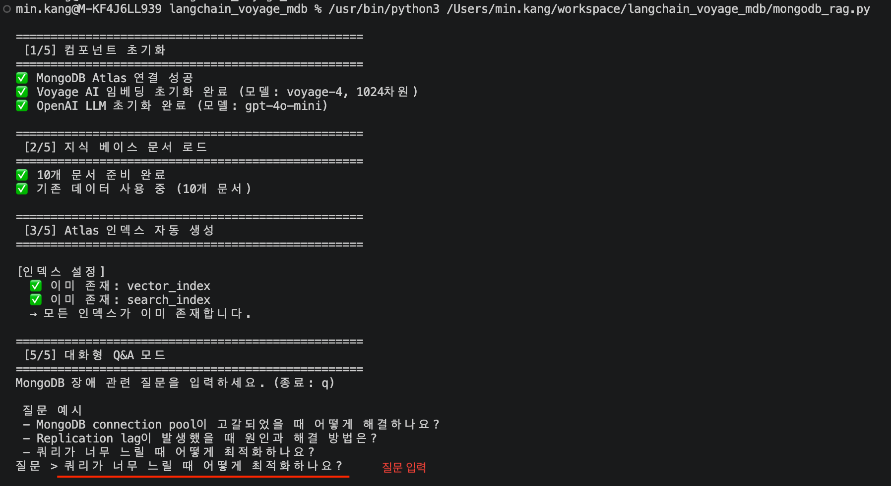

# Hands-on Lab - MongoDB 기술문제 답변 RAG 챗봇 개발

LangChain + Voyage AI + MongoDB Atlas + OpenAI를 활용한  
**하이브리드 검색(Hybrid Search) + RRF** 기반 RAG(Retrieval-Augmented Generation) 파이프라인

---

## 아키텍처

```
사용자 질문
     │
     ├─── [벡터 검색]  voyage-4 임베딩 → $vectorSearch → 순위 목록 A
     │
     ├─── [전문 검색]  $search (Atlas Search) → 순위 목록 B
     │
     └─── [RRF 융합]  1/(k+rank_A) + 1/(k+rank_B) → 최종 순위
                │
                └─── 상위 문서 → GPT-4o-mini → 최종 답변
```

## 사용 기술

| 역할 | 기술 |
|------|------|
| 임베딩 | [Voyage AI](https://www.voyageai.com/) `voyage-4` (1024차원) |
| 벡터 저장소 | [MongoDB Atlas](https://www.mongodb.com/atlas) Vector Search |
| 전문 검색 | MongoDB Atlas Search (Full-Text) |
| 검색 융합 | RRF (Reciprocal Rank Fusion) |
| 답변 생성 | [OpenAI](https://platform.openai.com/) `gpt-4o-mini` |
| RAG 파이프라인 | [LangChain](https://www.langchain.com/) LCEL |
| 인덱스 자동 생성 | `pymongo` 4.7+ `SearchIndexModel` |

## RRF (Reciprocal Rank Fusion) 란?

여러 검색 시스템의 결과를 순위 기반으로 통합하는 알고리즘입니다.

```math
\text{RRF\_score}(d) = \sum_{i \in \text{검색시스템}} \frac{1}{k + \text{rank}_i(d)}
```

- **벡터 검색** (시맨틱): 의미가 유사한 문서를 찾습니다
- **전문 검색** (키워드): 정확한 키워드가 포함된 문서를 찾습니다
- **RRF 융합**: 두 결과를 순위 기반으로 통합해 검색 품질을 향상합니다

---

## 파일 구성

```
├── mongodb_rag.py       # 메인 스크립트 (함수 기반 모듈 구조)
├── mongodb_rag.ipynb    # Jupyter 노트북 (Step별 학습용)
├── requirements.txt     # 의존성 패키지
├── .env.example         # 환경 변수 템플릿
└── .gitignore
```

---

## 빠른 시작

### 1. 저장소 복제

```bash
git clone https://github.com/<your-username>/langchain_voyage_mdb.git
cd langchain_voyage_mdb
```

### 2. 패키지 설치

```bash
pip install -r requirements.txt
```

### 3. 환경 변수 설정

```bash
cp .env.example .env
```

`.env` 파일을 열고 아래 3가지 키를 입력합니다:

```env
# MongoDB Atlas 연결 문자열
# Atlas UI → Database → Connect → Drivers 에서 확인
MONGODB_URI=mongodb+srv://<username>:<password>@<cluster>.mongodb.net/

# OpenAI API 키
# https://platform.openai.com/api-keys
OPENAI_API_KEY=sk-...

# Voyage AI API 키
# https://dash.voyageai.com/api-keys
VOYAGE_API_KEY=pa-...
```

> **API 키 발급 방법**
>
> **① MongoDB Atlas URI 연결 문자열 생성**
> 1. [무료 계정 생성](https://www.mongodb.com/cloud/atlas/register)
> 2. Atlas UI → Database → 클러스터 우측 **Connect** 클릭
> 3. **Drivers** 선택 → Python / pymongo 선택
> 4. 연결 문자열 복사 (`mongodb+srv://<username>:<password>@<cluster>.mongodb.net/`)
> - 상세 가이드: [Atlas URI 연결 문자열 생성](https://www.mongodb.com/ko-kr/docs/languages/python/pymongo-driver/current/get-started/#create-a-connection-string)
>
> **② Voyage AI API 키 발급**
> 1. MongoDB Atlas에 접속 후 좌측 메뉴에서 **Integrations** → **Voyage AI** 선택
> 2. API 키 생성
> - 상세 가이드: [Voyage AI API 키 생성](https://www.mongodb.com/ko-kr/docs/voyageai/quickstart/?llm-provider=anthropic#create-a-model-api-key)
>
> **③ OpenAI API 키 발급**
> - [OpenAI API Keys](https://platform.openai.com/api-keys)

### 4. MongoDB Atlas 클러스터 준비

- **M10 이상** 유료 클러스터 권장 (Vector Search + Atlas Search 전체 지원)
- M0 Free Tier는 Atlas Search 기능이 제한됩니다

### 5. 실행

```bash
# Python 스크립트 실행 (인덱스 자동 생성 포함)
python mongodb_rag.py
```



또는 Jupyter 노트북으로 단계별 실행:

```bash
jupyter notebook mongodb_rag.ipynb
```

---

## 주요 기능 설명

### 인덱스 자동 생성

Atlas UI에서 수동으로 인덱스를 만들 필요 없이, 코드 실행 시 자동으로 생성됩니다.

```python
from pymongo.operations import SearchIndexModel

# Vector Search 인덱스 (시맨틱 검색용)
SearchIndexModel(
    definition={"fields": [{"type": "vector", "path": "embedding",
                            "numDimensions": 1024, "similarity": "cosine"}]},
    name="vector_index",
    type="vectorSearch",
)

# Atlas Search 인덱스 (키워드 검색용)
SearchIndexModel(
    definition={"mappings": {"dynamic": False, "fields": {"text": {"type": "string"}}}},
    name="search_index",
    type="search",
)
```

### 하이브리드 검색

```python
results = hybrid_search(
    collection=collection,
    query="MongoDB connection pool 고갈 문제",
    embeddings=embeddings,
    k=10,        # 각 검색에서 가져올 결과 수
    rrf_k=60,    # RRF 상수 (높을수록 순위 차이 효과 완화)
)
```

### RRF 결과 출력 예시

```
  RRF (Reciprocal Rank Fusion) 검색 결과
===========================================================================
  순위 문서 제목                           벡터순위  텍스트순위  RRF점수      카테고리
---------------------------------------------------------------------------
  1    Connection Pool 고갈 문제           1        1          0.032787   connection
  2    인덱스 누락으로 인한 슬로우 쿼리       3        2          0.031185   performance
  3    Replication Lag 복제 지연 문제       2        -          0.016129   replication
===========================================================================
```

### 지식 베이스 (Knowledge Base)

현재 포함된 MongoDB 장애 시나리오 10가지:

| 카테고리 | 내용 |
|----------|------|
| `connection` | Connection Pool 고갈 |
| `performance` | 인덱스 누락으로 인한 슬로우 쿼리 |
| `replication` | Replication Lag, Primary 선출 실패 |
| `memory` | WiredTiger 캐시 부족, OOM 킬러 |
| `storage` | 디스크 공간 부족 |
| `locking` | Lock 경합 |
| `search` | Atlas Vector Search 인덱스 오류 |
| `backup` | Mongodump / Mongorestore |

---

## 직접 질문해보기

```python
from mongodb_rag import ask_mongodb_question

answer = ask_mongodb_question(
    question="MongoDB 서버가 갑자기 종료되었습니다. 원인과 해결 방법은?",
    collection=collection,
    embeddings=embeddings,
    llm=llm,
)
```

---

## 참고 자료

- [MongoDB Atlas Vector Search 공식 문서](https://www.mongodb.com/docs/atlas/atlas-vector-search/)
- [MongoDB Atlas Search 공식 문서](https://www.mongodb.com/docs/atlas/atlas-search/)
- [Voyage AI 모델 문서](https://docs.voyageai.com/docs/embeddings)
- [LangChain MongoDB 통합](https://python.langchain.com/docs/integrations/vectorstores/mongodb_atlas/)
- [RRF 논문 (Cormack et al., 2009)](https://plg.uwaterloo.ca/~gvcormac/cormacketal09-rrf.pdf)

---

## 라이선스

MIT License
