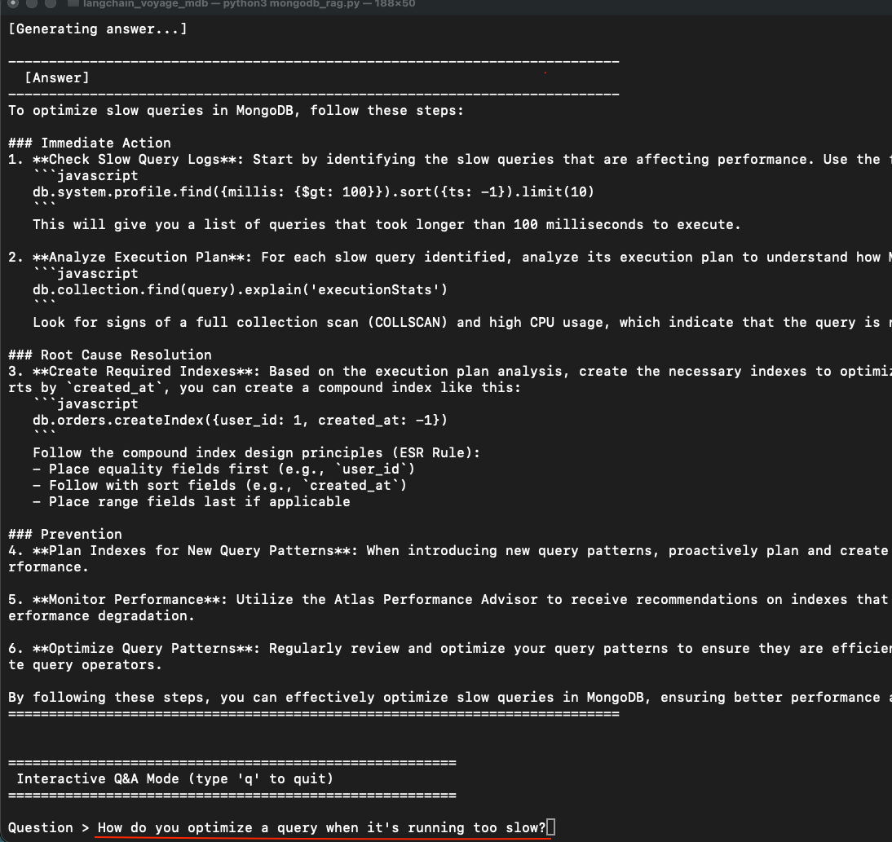

# Hands-on Lab - MongoDB Troubleshooting RAG Chatbot

> 🇰🇷 [한국어 버전은 여기를 클릭하세요 → README_KR.md](README_KR.md)

A RAG (Retrieval-Augmented Generation) pipeline based on **Hybrid Search + RRF**,  
built with LangChain + Voyage AI + MongoDB Atlas + OpenAI.

> ⚠️ **Requires MongoDB Atlas M10+ cluster** for `$vectorSearch`.

---

## Architecture

```
User Question
     │
     ├─── [Vector Search]    voyage-4 → $vectorSearch (Atlas) → Ranked List A
     │
     ├─── [Full-Text Search] $search  (Atlas Search)          → Ranked List B
     │
     └─── [RRF Fusion]  1/(k+rank_A) + 1/(k+rank_B) → Final Ranking
                │
                └─── Top Documents → GPT-4o-mini → Final Answer
```

## Tech Stack

| Role | Technology |
|------|------------|
| Embedding | [Voyage AI](https://www.voyageai.com/) `voyage-4` (1024 dimensions) |
| Vector Search | MongoDB Atlas `$vectorSearch` (requires **M10+**) |
| Full-Text Search | MongoDB Atlas Search (`$search`) |
| Document Storage | [MongoDB Atlas](https://www.mongodb.com/atlas) |
| Search Fusion | RRF (Reciprocal Rank Fusion) |
| Answer Generation | [OpenAI](https://platform.openai.com/) `gpt-4o-mini` |
| RAG Pipeline | [LangChain](https://www.langchain.com/) LCEL |
| Auto Index Creation | `pymongo` 4.7+ `SearchIndexModel` |

## What is RRF (Reciprocal Rank Fusion)?

An algorithm that combines results from multiple retrieval systems using rank-based scoring.

```math
\text{RRF\_score}(d) = \sum_{i \in \text{systems}} \frac{1}{k + \text{rank}_i(d)}
```

- **Vector Search** (Semantic): Finds documents with similar meaning using `$vectorSearch`
- **Full-Text Search** (Keyword): Finds documents containing exact keywords using `$search`
- **RRF Fusion**: Combines both results by rank to improve overall retrieval quality

---

## File Structure

```
├── mongodb_rag.py       # Main script (function-based modular structure)
├── mongodb_rag.ipynb    # Jupyter Notebook (step-by-step tutorial)
├── requirements.txt     # Dependencies
├── .env.example         # Environment variable template
└── .gitignore
```

---

## Quick Start

### 1. Clone the Repository

```bash
git clone https://github.com/min-hol-repo/langchain_voyage_mdb.git
cd langchain_voyage_mdb
```

### 2. Install Packages

```bash
pip install -r requirements.txt
```

### 3. Set Environment Variables

```bash
cp .env.example .env
```

Open the `.env` file and fill in the following three keys:

```env
# MongoDB Atlas connection string
# Find it at: Atlas UI → Database → Connect → Drivers
MONGODB_URI=mongodb+srv://<username>:<password>@<cluster>.mongodb.net/

# OpenAI API key
# https://platform.openai.com/api-keys
OPENAI_API_KEY=sk-...

# Voyage AI API key
# https://dash.voyageai.com/api-keys
VOYAGE_API_KEY=pa-...
```

> **How to Get API Keys**
>
> **① MongoDB Atlas URI Connection String**
> 1. [Create a free account](https://www.mongodb.com/cloud/atlas/register)
> 2. Atlas UI → Database → Click **Connect** on the right side of your cluster
> 3. Select **Drivers** → Choose Python / pymongo
> 4. Copy the connection string (`mongodb+srv://<username>:<password>@<cluster>.mongodb.net/`)
> - Detailed guide: [Create Atlas URI Connection String](https://www.mongodb.com/docs/languages/python/pymongo-driver/current/get-started/#create-a-connection-string)
>
> **② Voyage AI API Key**
> 1. In MongoDB Atlas, navigate to **Integrations** → **Voyage AI** from the left menu
> 2. Generate an API key
> - Detailed guide: [Create Voyage AI API Key](https://www.mongodb.com/docs/voyageai/quickstart/?llm-provider=anthropic#create-a-model-api-key)
>
> **③ OpenAI API Key**
> - [OpenAI API Keys](https://platform.openai.com/api-keys)

### 4. Prepare MongoDB Atlas Cluster

> ⚠️ **MongoDB Atlas M10+ cluster is required** for `$vectorSearch`.  
> `$vectorSearch` is not available on Free Tier (M0).

**Options to get an M10+ cluster:**

| Option | Cost | Notes |
|--------|------|-------|
| New account free credit | **Free** | $200 credit for new Atlas accounts |
| Atlas Local (Docker) | **Free** | Run Atlas locally, supports `$vectorSearch` |
| Temporary M10+ | ~$0.08/hr | Create → use → delete after lab |
| Paid M10+ | $57+/month | For production or ongoing use |

**Atlas Local (Docker) — recommended for development:**
```bash
# Install Atlas CLI and run locally
atlas deployments setup --type local
atlas deployments start
```

### 5. Run

```bash
# Run Python script (indexes are created automatically)
python mongodb_rag.py
```



Or run step-by-step with the Jupyter Notebook:

```bash
jupyter notebook mongodb_rag.ipynb
```

---

## Key Features

### Automatic Index Creation

Both Atlas indexes are created automatically at runtime — no manual setup in the Atlas UI.

```python
from pymongo.operations import SearchIndexModel

# [1] Vector Search index — $vectorSearch semantic search (requires M10+)
SearchIndexModel(
    definition={"fields": [{"type": "vector",
                            "path": "embedding",
                            "numDimensions": 1024,
                            "similarity": "cosine"}]},
    name="vector_index",
    type="vectorSearch",
)

# [2] Atlas Search index — $search full-text search
SearchIndexModel(
    definition={"mappings": {"dynamic": False,
                             "fields": {"text":  {"type": "string"},
                                        "title": {"type": "string"}}}},
    name="search_index",
    type="search",
)
```

### Vector Search — $vectorSearch

```python
pipeline = [
    {
        "$vectorSearch": {
            "index": "vector_index",        # Atlas Vector Search index name
            "path": "embedding",            # embedding field
            "queryVector": query_embedding, # voyage-4 query vector (1024 dims)
            "numCandidates": 100,           # candidate pool (10x limit recommended)
            "limit": 10,                    # final result count
        }
    },
    {
        "$project": {
            "_id": 1, "text": 1, "title": 1, "category": 1,
            "vector_score": {"$meta": "vectorSearchScore"},  # cosine similarity score
        }
    },
]
results = list(collection.aggregate(pipeline))
```

### Full-Text Search — $search

```python
pipeline = [
    {
        "$search": {
            "index": "search_index",
            "text": {"query": query, "path": ["text", "title"]},
        }
    },
    {"$limit": 10},
    {
        "$project": {
            "_id": 1, "text": 1, "title": 1, "category": 1,
            "text_score": {"$meta": "searchScore"},
        }
    },
]
results = list(collection.aggregate(pipeline))
```

### Hybrid Search

```python
results = hybrid_search(
    collection=collection,
    query="MongoDB connection pool exhaustion issue",
    embeddings=embeddings,
    k=10,        # Number of results per search
    rrf_k=60,    # RRF constant (higher = less rank-difference effect)
)
```

### RRF Output Example

```
  RRF (Reciprocal Rank Fusion) Search Results
==============================================================================
  Rank  Document Title                   VecSearch   TextSearch  RRF Score    Category
------------------------------------------------------------------------------
  1     Connection Pool Exhaustion       1           1           0.032787     connection
  2     Slow Queries - Missing Index     3           2           0.031185     performance
  3     Replication Lag                  2           -           0.016129     replication
==============================================================================
```

### Knowledge Base

10 MongoDB troubleshooting scenarios included:

| Category | Content |
|----------|---------|
| `connection` | Connection Pool Exhaustion |
| `performance` | Slow Queries due to Missing Indexes |
| `replication` | Replication Lag, Primary Election Failure |
| `memory` | WiredTiger Cache Shortage, OOM Killer |
| `storage` | Disk Space Shortage |
| `locking` | Lock Contention |
| `search` | Atlas Search Index Errors |
| `backup` | Mongodump / Mongorestore |

---

## Try Your Own Questions

```python
from mongodb_rag import ask_mongodb_question

answer = ask_mongodb_question(
    question="MongoDB server crashed unexpectedly. What are the causes and solutions?",
    collection=collection,
    embeddings=embeddings,
    llm=llm,
)
```

---

## References

- [MongoDB Atlas Vector Search Docs](https://www.mongodb.com/docs/atlas/atlas-vector-search/)
- [MongoDB Atlas Search Docs](https://www.mongodb.com/docs/atlas/atlas-search/)
- [Voyage AI Model Docs](https://docs.voyageai.com/docs/embeddings)
- [LangChain MongoDB Integration](https://python.langchain.com/docs/integrations/vectorstores/mongodb_atlas/)
- [RRF Paper (Cormack et al., 2009)](https://plg.uwaterloo.ca/~gvcormac/cormacketal09-rrf.pdf)

---

## License

MIT License
